## `oil-auto` Kullanıcı Kılavuzu - Ultra Detaylı Açıklama

`oil-auto` masaustu(electron(web)) uygulamasi rest api ile [yari offline](https://drive.google.com/file/d/16WvenQsLejOwUO1DhBnRCRlj3wy6wQJw/view?usp=drive_link)
lisans dogrulama sistemine ve kendi icinde veri tabanina sahiptir. iki
guncelleme secenegi yazdim: ota-code-update ve git komutunu kullanarak update,
bu ikiside guvenlik sebebiyle kodda yorum satiri. program sablon kaydedip, veya
duzenleyip bu sablonlar uzerinden onizleme yaparak qr kodlu fatura kesip
yazicidan veya dijital cikti almaya yarar. ayrica sablonlari filtreleyerek arama
secenegi vardir. Ciktiyi yazicidan alabilir yazici icin cikti boyutu ve yazici
secerek ayar kaydedebilirsiniz

### 1. Giriş

`oil-auto`, fatura templatelerini yönetmenize ve bu templateler uzerinden
digital veya yazicidan receipt(fis) ciktisi oluşturur. Lisans girdikten sonra
programi kullanabilirsiniz. Programi ilk calistirdiginizda lisanslama ekranina
yönlendirilirsiniz. Programi kullanmak icin bir lisans
anahtari girmeniz gerekmektedir. Lisans anahtarinizi girdikten sonra, programi
kullanmaya başlayabilirsiniz.

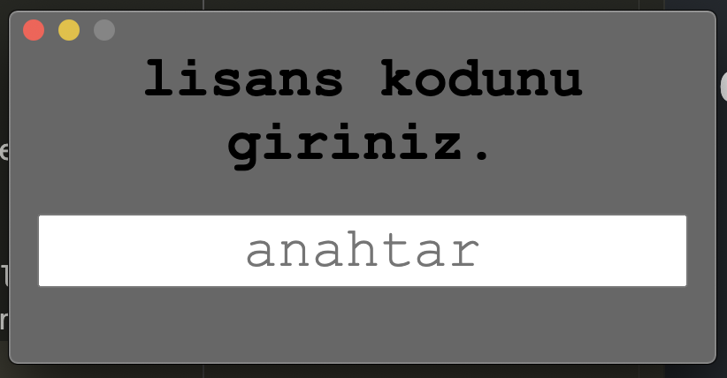

### 2. Uygulama Arayüzü

Uygulama arayüzü aşağıdaki bölümlerden oluşmaktadır:

**Başlık:**

* Yardım menüsü, uygulamayı kullanma hakkında bir kılavuza erişim sağlar.
Yaziciyi ve cikti boyutunu ayarlamak icin ayarlar bulunur.

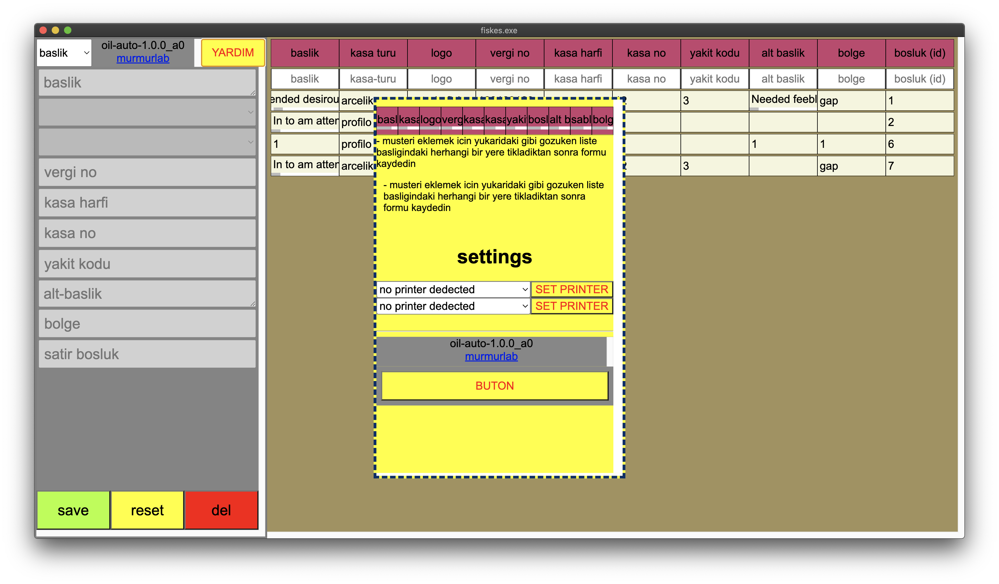

* Form Alanı: "Baslik" ve "Fiş Yaz" olmak üzere iki form içerir.
  * Baslik: sablon kaydetmeniz icin her fatura keseceginizde kalmasi gereken
  sabit veriler girilir, duzenlenir, sifirlanir veya form silinir.
  * Fis Yaz: kaydedilen sablon uzerinden degisken verileri girerek onizleme,
  sifirlama ve fisi yazdirma yapabilirsiniz.

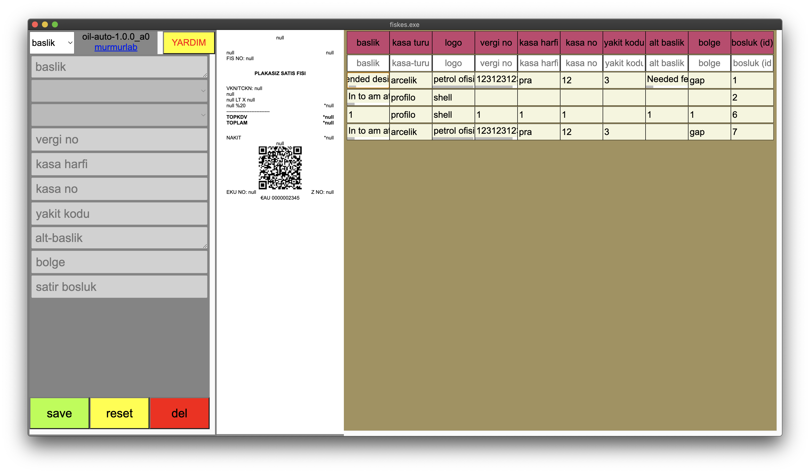
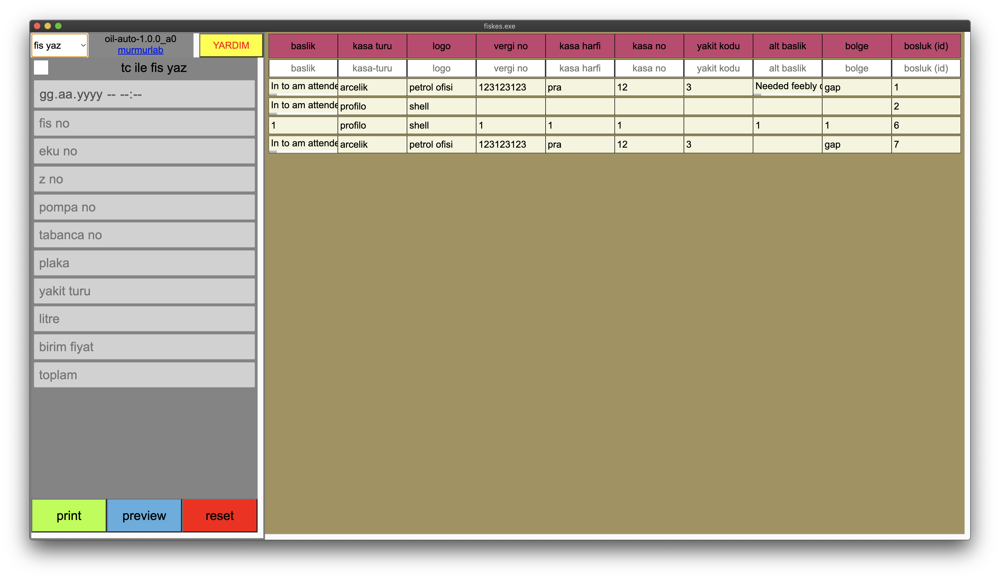

**Tablo Alanı:**

* Kaydedilen konfigürasyonların veya raporların bir listesini istediginiz her
sutununa filitreyi uygulayarak gösteren bir tablo.

*_fotografta yeni sablon eklemek icin tablo basligina tiklanmis durumda_
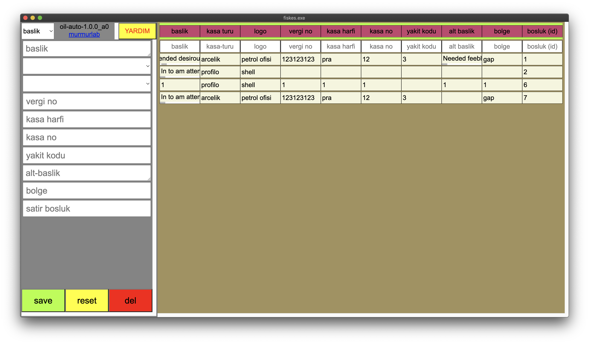

**Önizleme Paneli:**

* Doğru terimler ve alan adları çevirileri dahil olmak üzere, oluşturulan raporu
veya fişi yazdırmadan önce qr ile önizlemenizi sağlar.

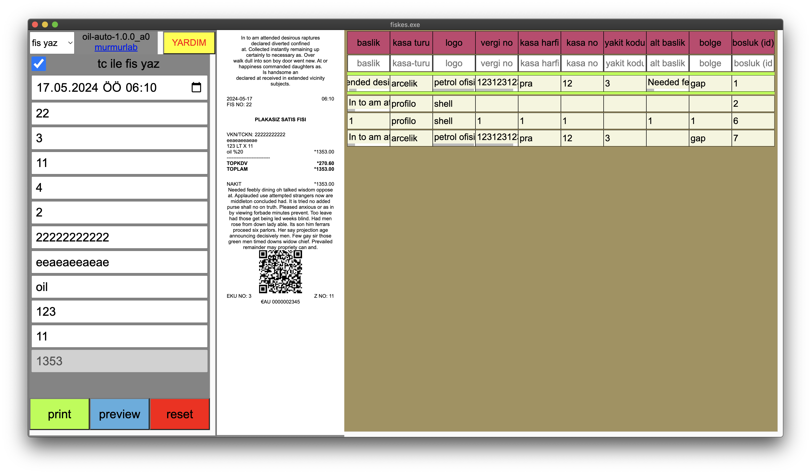
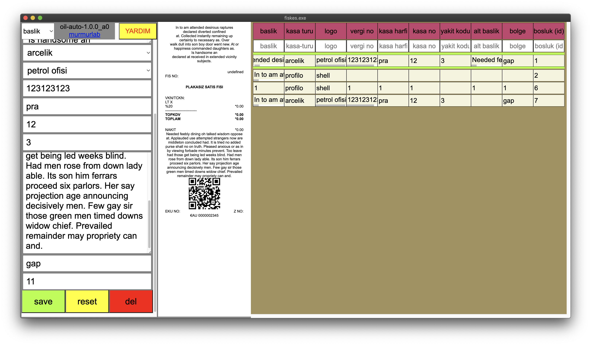

### 3. Formlar ve İşlevler

#### 3.1 Yazdır Formu

* **Amaç:** Bu form, uygulama için aşağıdakiler dahil olmak üzere konfigürasyonlar ayarlamaya olanak sağlar:
    * Doğru terimler ve alan adları çevrilmiş olarak değişkenler için yer tutucular içeren başlık ve dipnot metni.
    * Logo görüntüsü
    * Vergi numarası
    * Kasa detayları
    * Yakıt kodu
    * Rapor için ek detaylar
* **Giriş Alanları:**
    * Başlık ve dipnot metni, vergi numarası, kasa detayları ve ek bilgiler girmek için metin kutuları.
    * Logo görüntüsünü seçmek için açılır menü.
    * Çıkışa belirli değişkenlerin dahil edilmesini etkinleştirmek/devre dışı bırakmak için onay kutusu.
* **Düğmeler:**
    * **Kaydet:** Eger secili satir, filtrenin uzerinde bulunan tablo basligi
    ise girilen konfigürasyonları yeni bir sablon olarak kaydeder. Secili satir,
    mevcut bir sablon ise guncel bilgiler duzenlenebilir.
    * **Sıfırla:** Sablonun tüm giriş alanlarını temizler.
    * **Sil:** Sablonu siler.

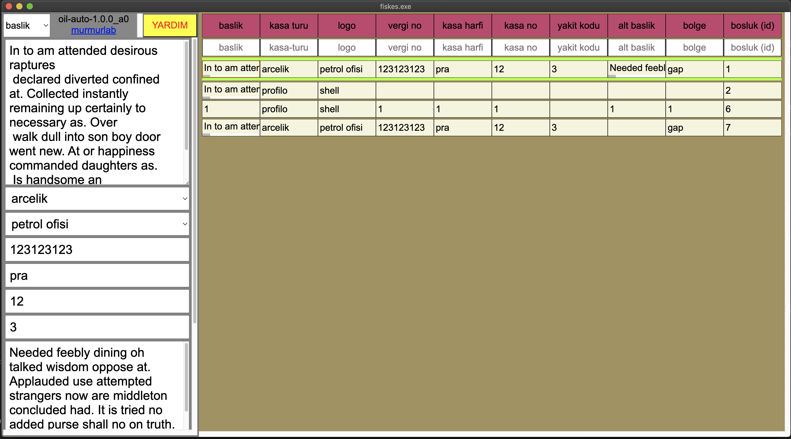
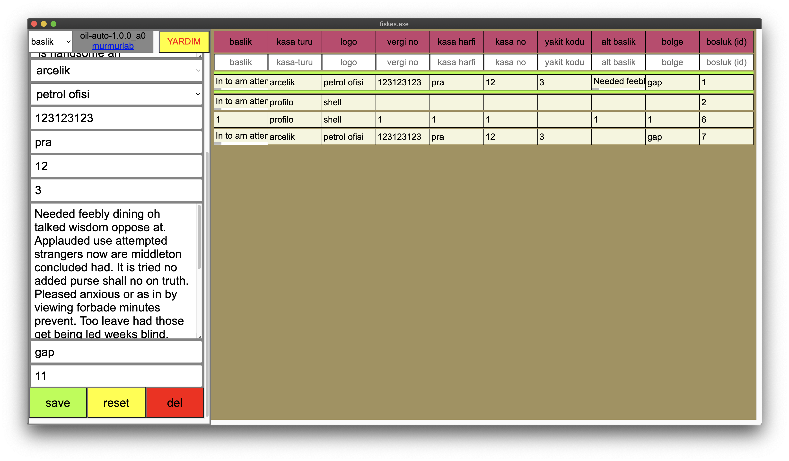
#### 3.2 Fiş Yaz Formu

* **Amaç:** Bu formda, secilen sablon icin degiskenler girilir ve fiş oluşturur.
    * İşlem tarihi ve saati
    * Fiş numarası
    * EKU numarası
    * Z numarası
    * Pompa numarası
    * Dolum yapan hortum numarası
    * Araç plaka numarası
    * Müşteri kimlik numarası (isteğe bağlı)
    * Şirket adı (isteğe bağlı)
    * Yakıt tipi
    * Litre cinsinden yakıt miktarı
    * Birim yakıt fiyatı
    * Toplam fiyat
    * Ödeme yöntemi (nakit)
* **Giriş Alanları:**
    * Tarih, saat, fiş numarası, EKU numarası, Z numarası, pompa numarası, dolum yapan hortum
    * numarası, araç plaka numarası, müşteri kimlik numarası, şirket adı, yakıt tipi, yakıt miktarı ve yakıt fiyatını girmek için metin kutuları.
    * Müşteri kimlik numarası girişini etkinleştirmek/devre dışı bırakmak için onay kutusu.
* **Düğmeler:**
    * **Yazdır:** Girilen verilere dayanarak fişin dijital ciktisini oluşturur
    ve yazdırır.
    * **Önizleme:** Yazdırmadan önce oluşturulan fişin önizlemesini gösterir.
    * **Sıfırla:** Formdaki tüm giriş alanlarını temizler.

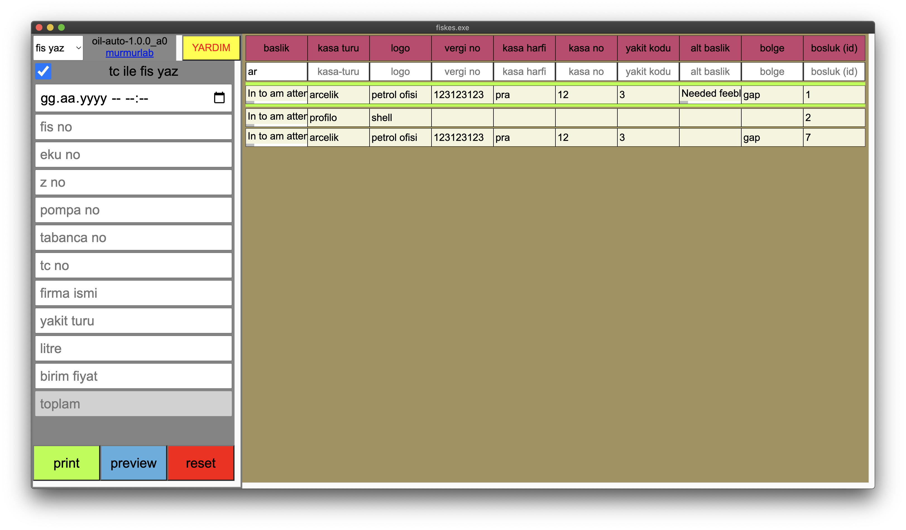
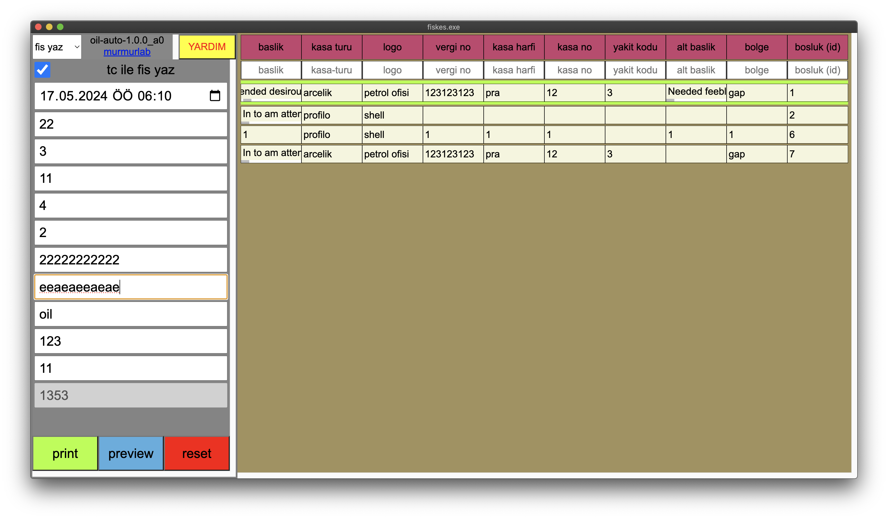

#### 4.1 Konfigürasyonları ve Raporları Depolama

* Uygulama, girilen sablonlari ve oluşturulan raporları depolar
* Bu kaydedilmiş girdilere tablo alanı aracılığıyla erişebilir ve bunları yönetebilirsiniz.
* Tablodaki her giriş, konfigürasyon veya rapor hakkındaki ayrıntıları icerir.

### 5. Ek Özellikler

* **Gerçek zamanlı çıktı önizlemesi:** Uygulama, formlara veri girdikçe, doğru terimler ve alan adları çevirileri ile oluşturulan raporun veya fişin önizlemesini görüntüler.
* **Klavye kısayolları:** Yazdırma (Ctrl+P) ve önizleme (Ctrl+E) gibi çeşitli işlemler için klavye kısayollarını kullanabilirsiniz.
* **QR kod oluşturma:** Uygulama, mobil tarama ve veri aktarımı için kullanılabilecek form veri bilgilerini kodlayan bir QR kod oluşturur.

### 6. Kullanilan Teknolojiler

* IndexedDB
* jspdf
* qrcodejs
* html2canvas
* electron
* hwid2 (for license)
* powershell, ghostscript, cmd (for print service)

### 7. Lisans Teknolojisi
* Uygulama, lisans doğrulama işlemleri için bir hmacsha256 ile hashlenen HWID tabanlı lisanslama ve sistemine sahiptir.
* Ilk calistirildiginda, uygulama bir lisans dosyasi olusturur ve bu dosyayi
  sunucuya gonderir. Sunucu, bunu dogrulayarak bir lisans anahtari olusturur
  ve uygulamaya geri gonderir. Uygulama, bu anahtari kullanarak lisans kaydeder ve lisanslama islemini tamamlar.
* Kopya lisanslama veya multiple device lisanslama korumasi var.

### 8. Kurulum

* Uygulamayı çalıştırmak için, uygulama dosyalarını indirin ve
`npm install` komutunu çalıştırın.
* Uygulamayı başlatmak için `npm start` yada `npm test` komutunu
çalıştırın.

### 9. Dağıtım

* Uygulamayı dağıtmak için, uygulama dosyalarını indirin ve `npm run package-<win/osx/linux>` komutunu çalıştırın.